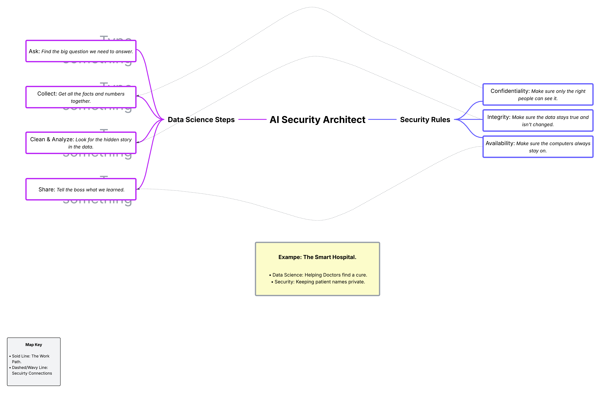

# AI Security Architect

This project shows the "Bridge" between Data Science and Security. 

## How the Bridge Works (The Dotted Lines) 
On the map, the **wavy dotted lines** show how the Secuirity Shield protects the Data Work: 
* **Confidentiality <--> Collect;** we protect data as soon as we get it.
* **Integrity <--> Analyze;** we make sure nobody changes the data while we study it.
* **Availability <--> Share;** we make sure the system is always ready for people to use.

---

## Industry Applications (The Bridge in Action) 

The "Bridge" design works in many important jobs. Here are three examples of how Data Sience and Security work together.

### 1. Self-Driving Cars (Share + Availability)
* **Data Science;** We use cameras and sensors to help the car see the road and other cars. It must share the data with the brakes instantly.
* **Security;** We stop hackers from taking control of the car's steering wheel or brakes. We make sure the car is always working so it can react in time.

### 2. Mining (Collect + Confidentiality)
* **Data Science;** We use sensors to find minerals deep underground. We use this data to create secret maps of where to dig.
* **Security;** We use confidntiality to protect the maps. This stops competitors from stealing them and ensures employees keep the data safe so the company stays ahead.

### 3. City Water Systems (Analyze + Integrity)
*  **Data Science;** We study how much water the city uses and exactly how many chemicas are needed to clean it.
* **Security;** We use intergrity to make sure hackers never change the chemical numbers or stop the system, ensuring the right amount of safe water is delivered every day.
